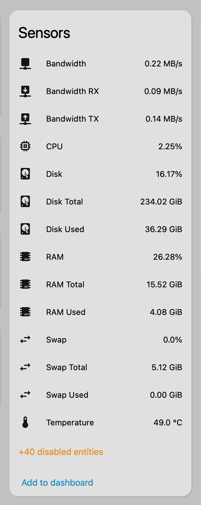
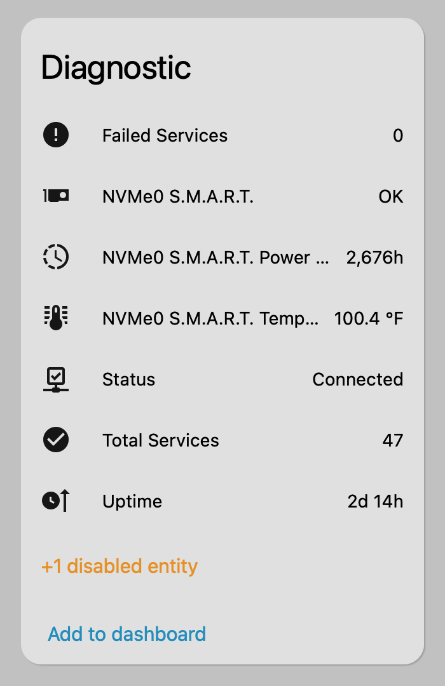

# Improved Beszel API

Improved Beszel API is a Home Assistant custom integration for [Beszel](https://www.beszel.dev/).

This project is a maintained fork of the original [`Ronjar/beszel-ha`](https://github.com/Ronjar/beszel-ha). The original integration is great but this fork exists to keep development moving, merge fixes faster, and expose more of the useful data already available in the Beszel backend. 

However, I am totally open with merging this back into the original project if that turns out to be better long term.

<table align="center" style="border-collapse: collapse;">
  <tr>
    <td align="center" style="border: none;">
       
      Sensors
    </td>
    <td align="center" style="border: none;">
       
      Diagnostics
    </td>
  </tr>
</table>

## What has changed vs the original?
In addition to the original sensors, it exposes:

- Additional disk usage / used / total sensors for extra disks reported by Beszel, such as `SDA`, `SDA Used`, and `SDA Total`
- Aggregate disk read / write sensors
- Per-disk read / write sensors for extra disks
- Per-interface bandwidth RX / TX rate
- Per-interface RX/TX byte counters
- Per-core CPU usage sensors
- Swap info when the system reports swap
- S.M.A.R.T. disk health entities and attributes
- S.M.A.R.T. temperature / power-on-hours sensors
- S.M.A.R.T. count sensors for key disk-failure indicators
- Load average sensors
- Named temperature sensors
- Per-interface bandwidth and byte-counter sensors
- Systemd service numbers
- RAM cache
- and more. 

It also adds **adjustable polling interval**, proper **state/device classes** so that HA unit changes work seamlessly, saner unit defaults, *and better icon choices :)*

## Installation
You can simply click here to install:

Or do it manually:

1. Open HACS.
2. Open the menu in the top right and select `Custom repositories`.
3. Add `https://github.com/inventor7777/improved-beszel-ha`.
4. Select category `Integration`.
6. Install `Improved Beszel API` from HACS.
7. Restart Home Assistant if needed.
8. Add the integration from the Home Assistant integrations page.

## Disclaimer

- This is a fork, not the original upstream integration. Credit goes fully to @ronjar for creation and initial development.
- All development after the original fork was done by GPT 5.4 Codex under close supervision and testing.

## Features

The integration connects to your [Beszel Hub](https://www.beszel.dev/guide/what-is-beszel) install through its PocketBase-backed API and creates Home Assistant entities for your monitored systems running [Beszel Agent](https://www.beszel.dev/guide/agent-installation)

It currently exposes:

- System connectivity / status
- CPU usage
- RAM usage percent
- RAM cache usage (disabled by default)
- RAM total
- RAM used
- Disk usage percent
- Disk total
- Disk used
- Aggregate disk reads / writes
- Aggregate disk I/O
- Disk I/O read / write rate
- Disk I/O total rate
- Swap usage percent
- Swap total
- Swap used
- Additional disk usage / used / total sensors for extra disks reported by Beszel, such as `SDA`, `SDA Used`, and `SDA Total`
- Additional disk I/O sensors for extra disks reported by Beszel, such as `SDA IO Read`, `SDA IO Write`, and `SDA IO`
- Uptime
- Main system temperature
- Additional named temperatures from Beszel when available
- Aggregate bandwidth
- Bandwidth RX / TX rate
- Per-interface bandwidth RX / TX rate
- Per-interface RX/TX byte counters
- Per-core CPU usage
- GPU usage when reported by Beszel
- Battery when reported by Beszel
- Beszel Hub update status
- S.M.A.R.T. disk health entities and attributes
- S.M.A.R.T. temperature / power-on-hours sensors
- S.M.A.R.T. count sensors for reallocated sectors, pending sectors, offline uncorrectable, load cycle count, and start/stop count
- Number of systemd services failed/running

Some noisier or less universally useful entities are disabled by default, such as:

- Load average sensors
- Per-core CPU sensors
- Aggregate disk reads / writes
- Aggregate disk I/O
- Disk I/O sensors
- Named temperature sensors when a system reports more than 4 named temperature zones
- Per-interface bandwidth and byte-counter sensors
- S.M.A.R.T. diagnostic sensors when a system has more disks
- RAM cache used

## Setup

When adding the integration, use:

- `URL`: The root URL / IP of your Beszel Hub, for example `http://192.168.0.0:8090`
- `Username`: Your Beszel user email/username
- `Password`: Your Beszel password
- `Verify SSL`: Whether to verify the Beszel SSL certificate
- `Check for updates`: Enables the Beszel Hub update entity 
- `Polling interval (seconds)`: How often Beszel data is refreshed, adjustable from 10 to 3600 seconds *(default: 120 seconds)*

## Notes

- Right now the integration adds all systems visible to the configured Beszel user.
- If you want to limit which systems show up in Home Assistant, the easiest approach is to create a Beszel user that only has access to the systems you want exposed.

## Entity Naming

Entities follow your Beszel system names. For example, if your system is named `test`, CPU usage will show up as something like `sensor.test_cpu`.

S.M.A.R.T. entities use disk-oriented names such as:

- `test SDA S.M.A.R.T.`
- `test SDA S.M.A.R.T. Temperature`
- `test NVMe0 S.M.A.R.T. Power On Hours`
- `test SDA S.M.A.R.T. Reallocated Sectors`
- `test SDA S.M.A.R.T. Pending Sectors`
- `test SDA S.M.A.R.T. Start Stop Count`

Additional non-primary disks reported by Beszel follow the same disk-first pattern, for example:

- `test SDA`
- `test SDA Used`
- `test SDA Total`
- `test SDA IO Read`
- `test SDA IO Write`
- `test SDA IO`

Aggregate disk I/O entities follow the system name, for example:

- `test IO Reads`
- `test IO Writes`
- `test IO`

Per-interface network entities follow the interface name and direction, for example:

- `test enp0s31f6 Bandwidth RX`
- `test enp0s31f6 Bandwidth TX`
- `test enp0s31f6 RX`
- `test enp0s31f6 TX`

Per-core CPU entities follow the CPU number, for example:

- `test CPU 1`
- `test CPU 2`

The main CPU sensor also includes CPU breakdown attributes such as `user_percent`, `system_percent`, `iowait_percent`, `steal_percent`, `idle_percent`, `other_percent`, plus flat per-core attributes like `cpu_1_percent` and `cpu_2_percent`.

Several sensor families also expose richer attributes on their main and related sensors:

- `CPU`: system CPU breakdown plus flat per-core values like `cpu_1_percent`
- `RAM`: total, used, cache, and swap values
- `Swap`: total, used, and percent values
- `Disk`: totals plus read / write / combined I/O rates
- `Bandwidth`: aggregate RX/TX plus nested per-interface RX/TX/bandwidth values
- `Temperature`: flat named temperature zone attributes like `acpitz_c` and `coretemp_core_0_c`
- `S.M.A.R.T.`: device metadata plus flattened `smart_*` health and attribute values

## Licensing

This project remains MIT-licensed and preserves attribution to the original project while adding attribution for this fork.
